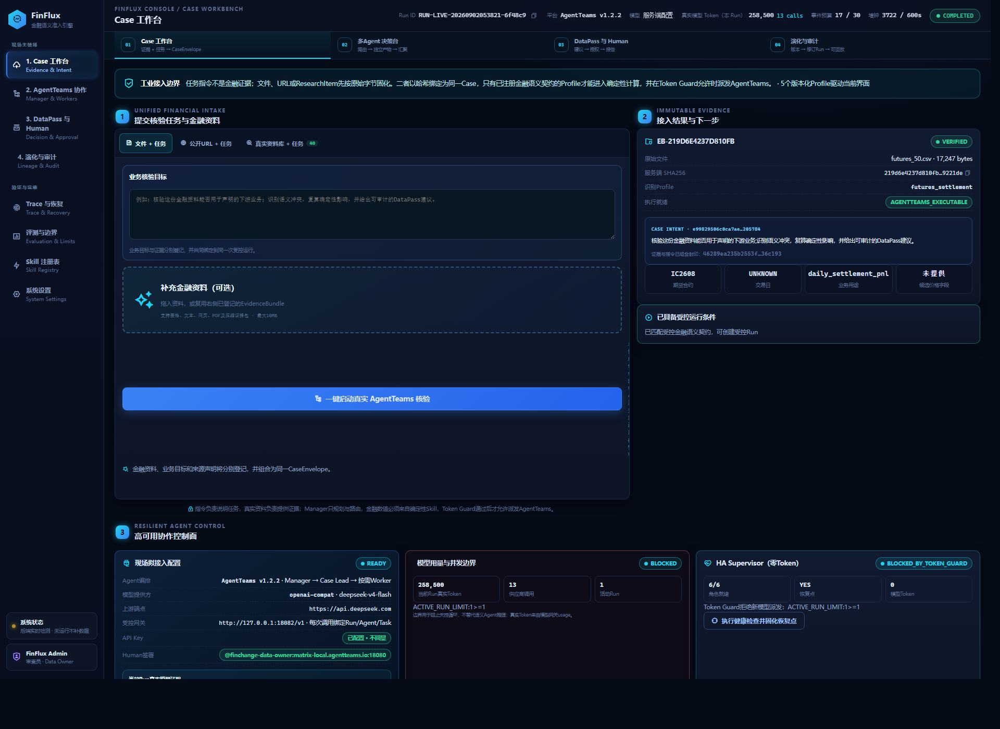
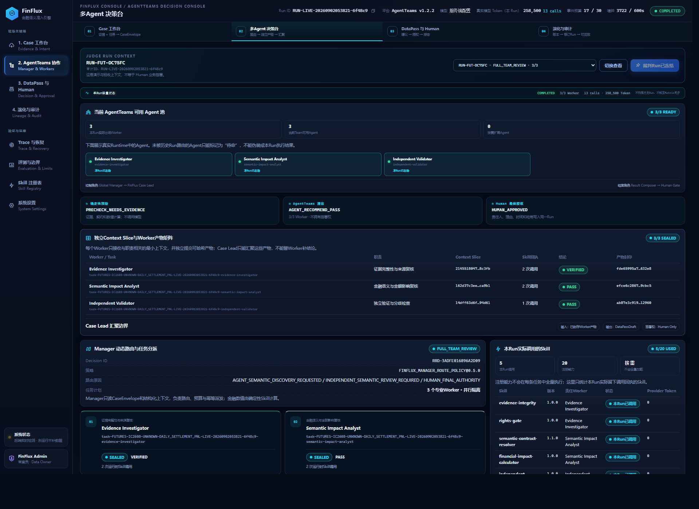
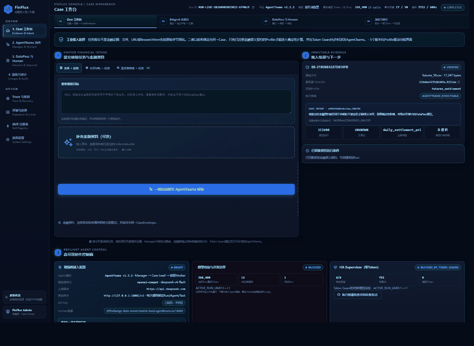
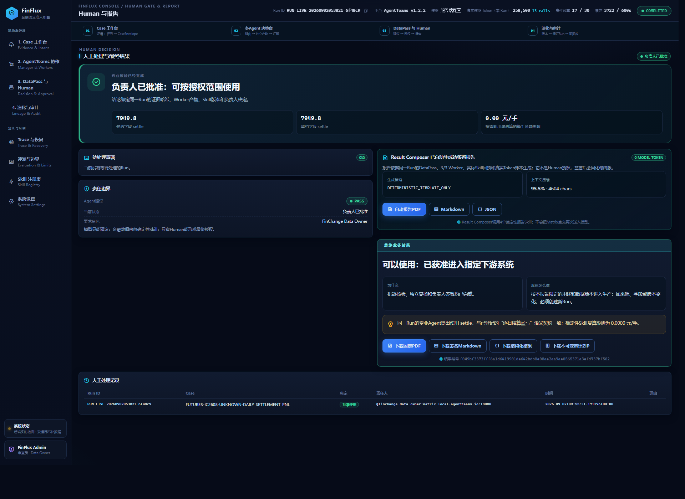
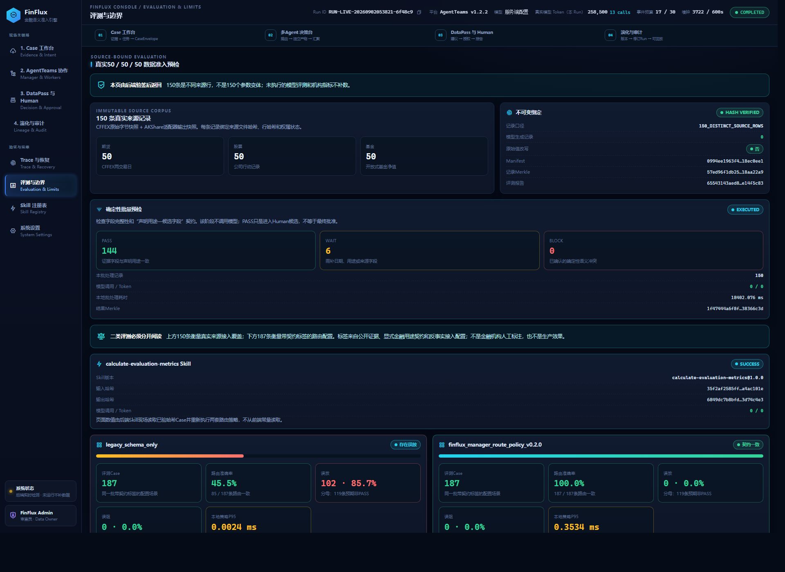

# FinFlux：金融语义准入与受控演化引擎

[](https://github.com/FocusCmy/FinFlux-Demo/actions/workflows/ci.yml)
[](LICENSE)

FinFlux在金融数据进入估值、结算、风控、研究或回测系统之前，完成来源固化、业务语义核验、多Agent专业复核、DataPass生成和Human签署。系统不把“接口返回成功”当成“金融含义正确”，也不允许模型直接改写金融数值或替代责任人批准。



## 核心运行链

1. 用户上传文件、粘贴金融文本或提供公开URL，并用自然语言说明下游用途。
2. 后端固化原始字节、来源声明和SHA256，形成不可变EvidenceBundle。
3. 确定性Profile先识别可验证字段；未知或证据不足的数据返回`WAIT`及补充项，不编造结论。
4. RunSupervisor在后台推进同一个Run：Manager动态路由，Case Lead派发按需Worker，Worker运行时发现并执行带版本的Skill。
5. Worker产物汇聚成DataPassDraft；`PASS`、`WAIT`、`BLOCK`都必须进入Human Gate，由责任人批准、退回或确认拦截。
6. 最终导出MD、PDF、JSON和审计ZIP；Trace关联模型输入输出、工具I/O、Skill版本、哈希、Token账本与人工签署。



## 界面预览与短演示

下图为5个真实前端页面组成的约8秒界面导览，方便首次了解操作顺序；它是截图轮播，不作为模型已经运行的证明。真实多Agent执行以同一Run的Matrix事件、Worker产物、Skill回执、模型网关Token账本及Human签署为准。



| 数据接入 | AgentTeams协作 |
| --- | --- |
| [](docs/screenshots/01-live-intake.png) | [](docs/screenshots/02-agentteams-collaboration.png) |
| DataPass与Human Gate | 评测与运行观测 |
| [](docs/screenshots/03-datapass-human.png) | [](docs/screenshots/04-evaluation.png) |

完整Trace与恢复页面：[查看原图](docs/screenshots/05-trace-recovery.png)。现场真实运行录像建议上传到该仓库的GitHub Release，再把附件链接补充到本节，避免把较大的MP4写入Git历史。

## 公开仓库边界

本仓库包含应用源码、必要测试、AgentTeams部署/Agent/Skill定义、协议、Docker文件和150条来源绑定记录的Manifest。`app/data/real_50x3_v1/manifest.json`记录期货、股票、基金各50条的来源URL、采集时间、来源文件SHA256、记录SHA256和权属状态。

以下内容故意不进入Git：API Key、Human凭据、运行时状态、Prompt/Token账本、历史Run、审计ZIP、视频、第三方原始行情以及内嵌AgentTeams源码。Manifest中的数据源均标记`REVIEW_REQUIRED`；评委或开发者应上传自己有权处理的数据进行现场复现。

## 环境要求

- Windows 10/11 + PowerShell 5.1/7，或Linux/macOS + Bash；
- Python 3.10–3.13（Docker镜像固定为Python 3.12）；
- Docker Desktop / Docker Engine 24+，支持`docker compose`；
- 完整多Agent演示需可拉取AgentTeams v1.2.2镜像并拥有一个OpenAI兼容模型API；
- 浏览器访问端口`8768`，AgentTeams默认使用`18080/18001/18088/18888`。

## 方式一：30秒启动前端和确定性内核

无需模型密钥，适合检查上传、EvidenceBundle、Profile预检、页面和API：

```powershell
git clone https://github.com/FocusCmy/FinFlux-Demo.git
cd FinFlux_demo
docker compose up --build -d
```

访问 <http://127.0.0.1:8768>，健康检查：

```powershell
Invoke-RestMethod http://127.0.0.1:8768/api/status
docker compose ps
```

停止：

```powershell
docker compose down
```

此模式没有伪装成AgentTeams运行：Runtime未部署时，模型链严格显示未就绪；确定性预检仍可运行。

如果构建停在`failed to fetch anonymous token`，表示主机无法访问Docker Hub鉴权服务。请先配置Docker Desktop代理或镜像加速，并确认能够拉取`python:3.12-slim`，再重新执行`docker compose up --build -d`；不要把该网络错误解释成FinFlux运行成功。也可以从可访问的镜像仓库替换基础镜像：

```powershell
$env:FINFLUX_PYTHON_IMAGE = '<可访问镜像仓库>/library/python:3.12-slim'
docker compose up --build -d
```

## 方式二：源码启动和自检

```powershell
python -m venv .venv
.\.venv\Scripts\Activate.ps1
python -m pip install --upgrade pip
pip install -r requirements.txt
powershell -ExecutionPolicy Bypass -File .\scripts\FinFlux.ps1 -Action Validate
powershell -ExecutionPolicy Bypass -File .\scripts\FinFlux.ps1 -Action Start
```

Linux/macOS：

```bash
python3 -m venv .venv
source .venv/bin/activate
pip install -r requirements.txt
bash scripts/start-local-demo.sh
```

## 方式三：完整AgentTeams v1.2.2现场链

凭据必须保存在仓库外。先复制模板：

```powershell
Copy-Item .\agentteams\.env.example C:\finflux-runtime.env
notepad C:\finflux-runtime.env
```

至少填写以下内容；模型名称按供应商实际支持值填写：

```dotenv
AGENTTEAMS_LLM_PROVIDER=openai-compat
AGENTTEAMS_DEFAULT_MODEL=<model-name>
AGENTTEAMS_OPENAI_BASE_URL=<provider-base-url>
AGENTTEAMS_LLM_API_KEY=<api-key>
AGENTTEAMS_ADMIN_PASSWORD=<strong-local-password>
```

先拉取并校验官方AgentTeams源码（写入已忽略的`.cache`，不会提交），再构建八个可路由Worker包、完成本地冷启动、部署Runtime并启动FinFlux：

```powershell
powershell -ExecutionPolicy Bypass -File .\scripts\FinFlux.ps1 -Action BootstrapAgents
powershell -ExecutionPolicy Bypass -File .\scripts\FinFlux.ps1 -Action BuildAgents
powershell -ExecutionPolicy Bypass -File .\scripts\FinFlux.ps1 -Action ColdStart
powershell -ExecutionPolicy Bypass -File .\scripts\FinFlux.ps1 -Action Deploy -RuntimeEnvFile C:\finflux-runtime.env
powershell -ExecutionPolicy Bypass -File .\scripts\FinFlux.ps1 -Action Start -RuntimeEnvFile C:\finflux-runtime.env
```

`ColdStart`证明干净副本能从空状态启动Web/API并读取150条Manifest；`Deploy`的预检和Runtime状态页负责证明AgentTeams资源真实Ready。任一步失败，系统都不会生成假的Worker结果。若Human账号由CR生成，再执行：

```powershell
powershell -ExecutionPolicy Bypass -File .\agentteams\scripts\Show-AgentTeamsHumanCredential.ps1
```

把得到的Human用户名和密码写入仓库外的`C:\finflux-runtime.env`，重启FinFlux。不要把该文件复制回项目。

## 现场操作

1. 打开“数据接入”，拖入CSV/JSON/PDF/文本，或填写公开URL。
2. 业务目标写清“用于什么系统、什么日期、需要核验什么语义”，例如：`核验这份期货数据是否可用于每日盈亏结算，并说明候选字段的语义依据。`
3. 点击“一键启动真实AgentTeams核验”。浏览器只观察；RunSupervisor在后台持续同步Matrix、Worker产物和模型网关账本。
4. 在“AgentTeams协作”查看Manager路由、Case Lead派发、Worker和Skill版本；在“Trace”展开模型、工具和Token证据。
5. Run到达`AWAITING_HUMAN`后进入“Human Gate”：批准、补充材料后再判断，或确认拦截。Agent建议不能自行变成最终批准。
6. 签署后导出最终报告和审计ZIP。


## 状态含义

- `PASS`：证据和契约支持进入人工批准候选，不代表Agent已经批准。
- `WAIT`：用途、来源、权属、时间或证据不足；界面列出必须补充的内容。
- `BLOCK`：已观察到确定性冲突或可量化影响；界面给出依据和修订建议，Human可退回形成Child Run复核。
- `AWAITING_HUMAN`：多Agent核验已经结束，等待有责任权限的人作最终决定。

## 验证与GitHub提交

提交前执行：

```powershell
powershell -ExecutionPolicy Bypass -File .\scripts\FinFlux.ps1 -Action Validate
git status --short
```

该门禁执行Worker包构建、AgentTeams配置校验、Skill烟测、核心单元测试和前端JavaScript语法检查。它不调用模型，不产生费用。完整模型链由现场上传数据触发，Token必须来自模型网关账本，不能由前端估算。

初始化自己的GitHub仓库：

```powershell
git init
git add .
git commit -m "feat: publish FinFlux runnable demo"
git branch -M main
git remote add origin https://github.com/FocusCmy/FinFlux-Demo.git
git push -u origin main
```

## 目录

```text
app/                         后端、前端、RunSupervisor、协议与必要测试
app/agentteams-skills/       可运行、带版本和哈希的Skill
app/data/real_50x3_v1/       150条Manifest和聚合评测；不含第三方原始快照
app/data/research_data_layer_v1/ 研报/宏观资料元数据、来源链接与哈希；不含原始正文
agentteams/                  Agent/Skill包、CR配置及部署/恢复脚本
scripts/                     统一启动与验收入口
docs/screenshots/            精选真实界面截图
Dockerfile                   FinFlux应用镜像
docker-compose.yml           单机Web/确定性内核启动
LICENSE                      Apache-2.0
THIRD_PARTY_NOTICES.md       AgentTeams及金融数据边界
```

## 许可证

FinFlux代码采用[Apache License 2.0](LICENSE)。第三方项目和金融数据不因本许可证获得再授权，详见[THIRD_PARTY_NOTICES.md](THIRD_PARTY_NOTICES.md)。
